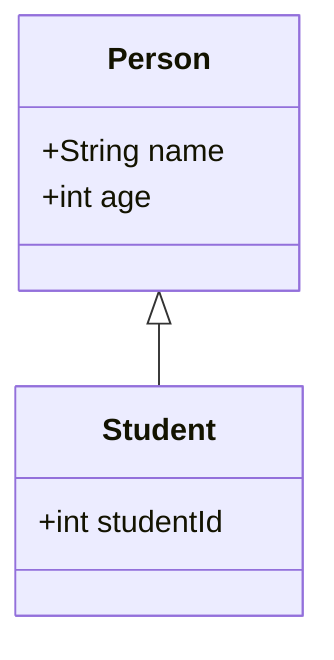
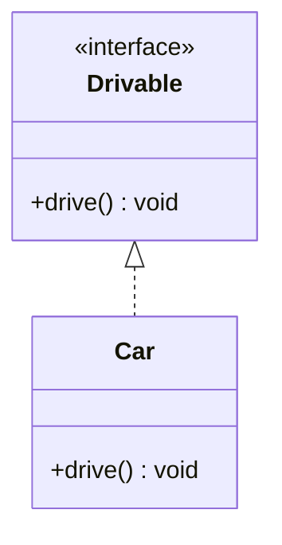
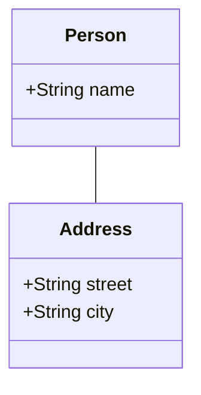
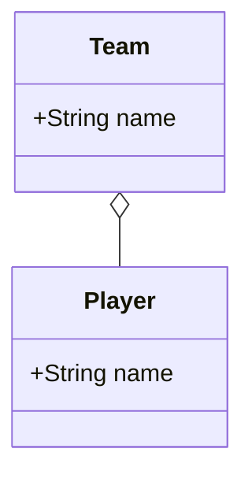
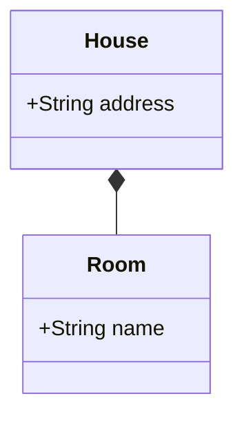
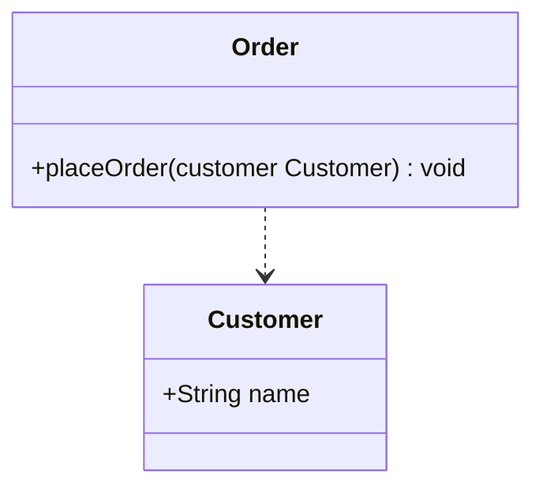
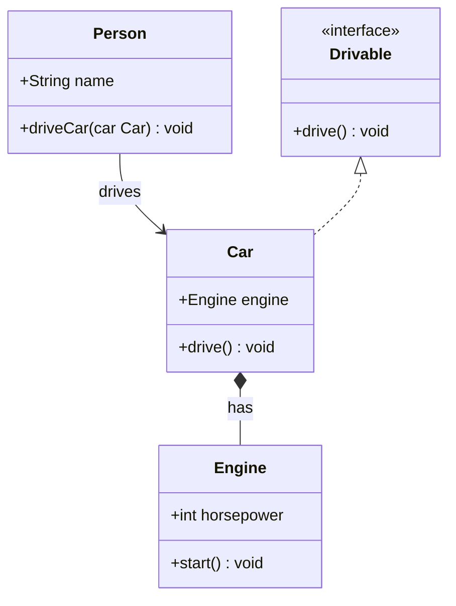

示例使用 [Mermaid](https://mermaid.js.org/) 类图语法，在支持 Mermaid 的 Markdown 中可直接渲染。

#### 1. 继承（Generalization）
继承关系表示类与类之间的父子关系，子类继承父类的属性和方法。
- **表示**：使用带实心三角箭头的实线，箭头指向父类。
- **示例**：`Person <|-- Student`

#### 2. 实现（Realization）
实现关系表示类与接口之间的关系，类实现接口定义的方法。
- **表示**：使用带空心三角箭头的虚线，箭头指向接口。
- **示例**：`Drivable <|.. Car`

#### 3. 关联（Association）
关联关系表示类与类之间的静态关系，一个类持有另一个类的实例。
- **表示**：使用实线，箭头可选，指向被关联的类。
- **示例**：`Person -- Address`

#### 4. 聚合（Aggregation）
聚合关系表示整体与部分的关系，部分可以独立于整体存在。
- **表示**：使用带空心菱形箭头的实线，菱形指向整体。
- **示例**：`Team o-- Player`

#### 5. 组合（Composition）
组合关系表示整体与部分的关系，部分不能独立于整体存在。
- **表示**：使用带实心菱形箭头的实线，菱形指向整体。
- **示例**：`House *-- Room`

#### 6. 依赖（Dependency）
依赖关系表示一个类依赖于另一个类，通常是方法参数或局部变量。
- **表示**：使用虚线，箭头指向被依赖的类。
- **示例**：`Order ..> Customer`

### 综合示例

以下是一个包含多种关系的综合类图示例：

在这个示例中：
- `Car *-- Engine : has` 表示组合关系，`Car`包含一个`Engine`，但`Engine`不能独立存在。
- `Person --> Car : drives` 表示`Person`使用`Car`（带方向的关联）。
- `Drivable <|.. Car` 表示`Car`实现了`Drivable`接口。
